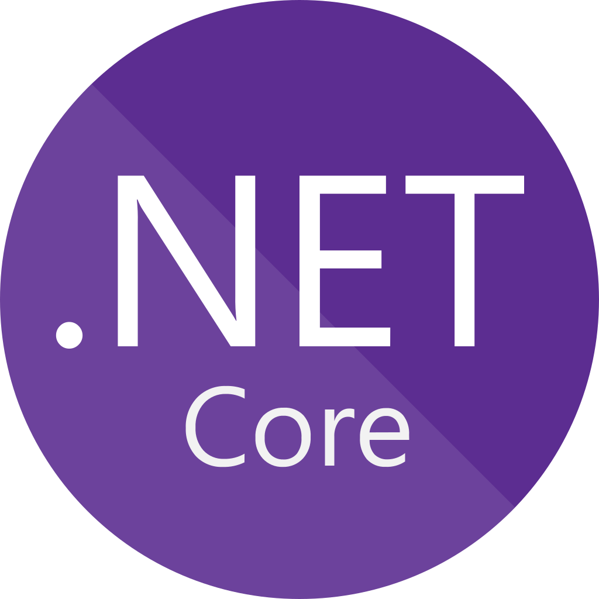

<h1 align="left">Hi there👋, I'm Mithun Kumar Pandeti</h1>

I am a full stack developer. Currently, I'm working at <a href="https://github.com/NYCOpportunity">@NYCOpportunity</a>. Previously, I worked at Accenture

<h3>Currently I am working with ...</h3>

  
  
  
  
  
  
  

<h3>I have also worked with ...</h3>

 
  
  
  
  
  
  

<h3>You can also find me on ...</h3>

  
  

